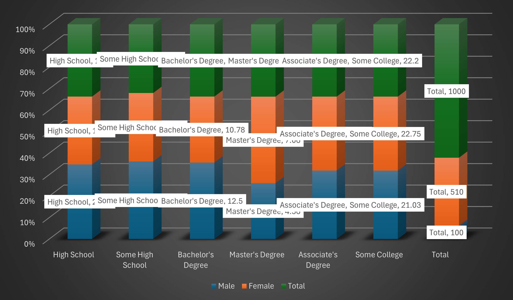
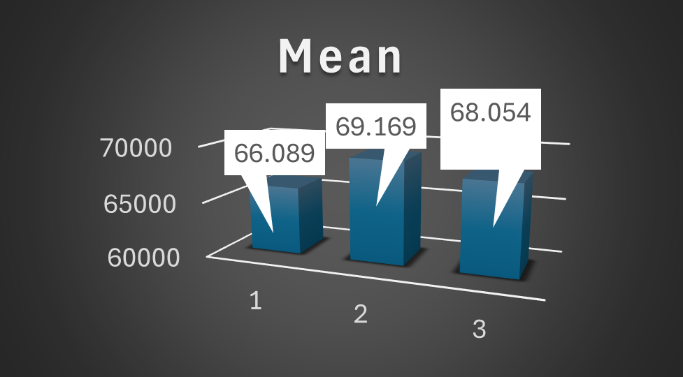
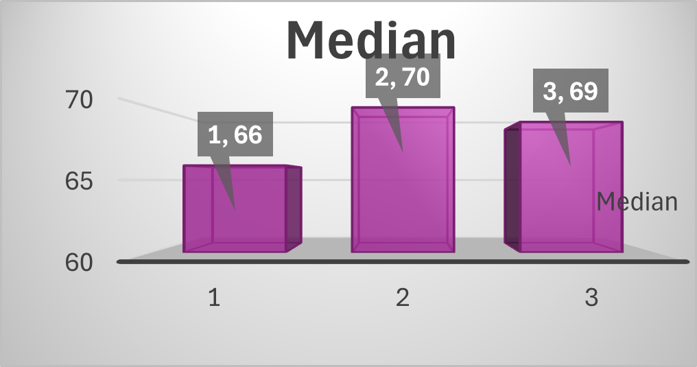
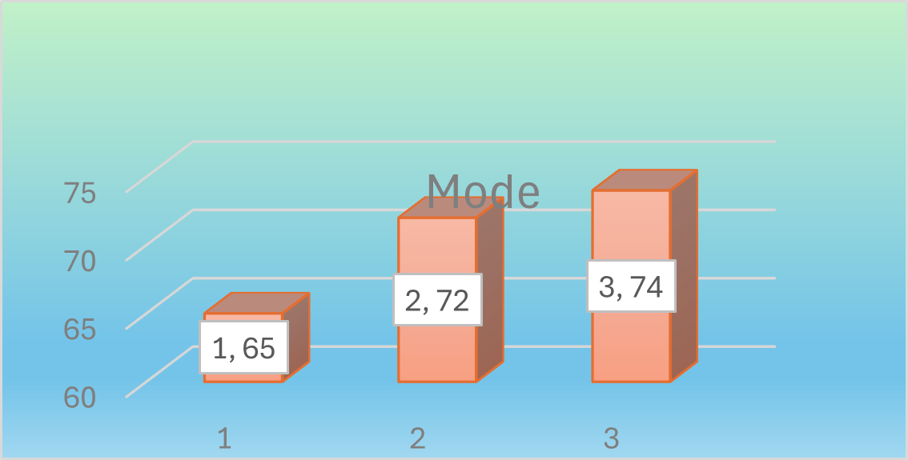

# Statistics 1 — Extra Activity 3 (Excel + PNG Outputs)

This folder contains **Extra Activity 3** for a *Statistics 1 / Basic Statistics* course.

- **Main work file:** `ACTIVITY 3.xlsx`
- **Preview outputs:** PNG images (mean, median, mode, interpretation, and a comparison chart)

---

## Total items in this folder

- **Total files:** 7  
  - **1 Excel file** (`.xlsx`)
  - **5 image files** (`.png`)
  - **1 README** (`README.md`)

---

## Files

### Main workbook
- `ACTIVITY 3.xlsx`

---

## PNG outputs (preview)

### Interpretation

### Mean

### Median

### Mode

### Reading score vs Writing score

---

## How to use

1. Open **`ACTIVITY 3.xlsx`** in **Microsoft Excel** (recommended).
2. Save a personal copy:
   - Example: `ACTIVITY 3 - YourName.xlsx`
3. Complete the calculations/graphs in the workbook.
4. Use the PNG files above to preview results directly in GitHub.

---
