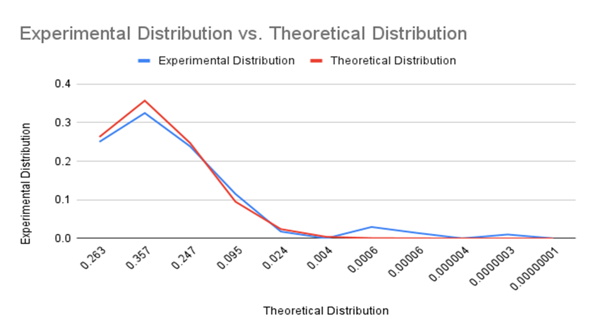

# Statistics 1 — Extra Activity 4 (Excel + Chart Preview)

This folder contains **Extra Activity 4** for a *Statistics 1 / Basic Statistics* course.

- **Main work file:** `STATISTICS - 1 Activity - 4.xlsx`
- **Chart preview:** `statistics_activity_4_chart.png`

---

## Total items in this folder

- **Total files:** 3  
  - **1 Excel file** (`.xlsx`)
  - **1 image** (`.png`)
  - **1 README** (`README.md`)

---

## Files

- `STATISTICS - 1 Activity - 4.xlsx` — activity workbook (questions + calculations)
- `statistics_activity_4_chart.png` — exported chart/graph preview

---

## Chart Preview (PNG)

---

## How to use

1. Open **`STATISTICS - 1 Activity - 4.xlsx`** in **Microsoft Excel** (recommended).
2. Save your own copy:
   - Example: `STATISTICS - 1 Activity - 4 - YourName.xlsx`
3. Complete the calculations and update the chart(s) if required.
4. The image above is a quick preview of the chart for GitHub viewing.

---

## Notes / Troubleshooting

- If the image doesn’t display on GitHub:
  - Confirm filename matches exactly: `statistics_activity_4_chart.png`
  - Refresh the page (Ctrl+F5)
  - Make sure you are viewing on GitHub.com (not a text-only viewer)
