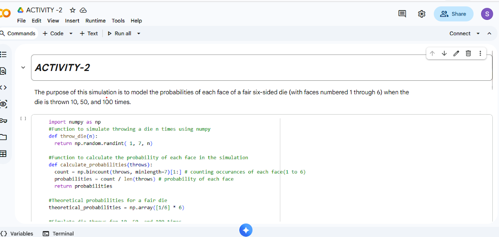

# Activity 2: Dice Probability — Theoretical vs Monte Carlo Simulation

## Project Description
This activity demonstrates how **Monte Carlo simulation** estimates probabilities through repeated random trials and how those estimates move closer to **theoretical probability** as the number of trials increases.  
A fair six‑sided die is simulated for **10**, **50**, and **100** rolls, and the probability of each face (1–6) is compared against the theoretical value.

## Objectives
- Calculate **theoretical probability** for a fair die.
- Run **Monte Carlo simulations** for different sample sizes (10, 50, 100).
- Compare simulated probabilities with theoretical probabilities.
- Observe the effect of increasing trials (Law of Large Numbers).

## Features
- Dice roll simulation for multiple trial counts (10 / 50 / 100)
- Frequency counting for faces 1–6
- Monte Carlo probability calculation
- Side-by-side comparison with theoretical probability
- Includes a report (`.docx`), notebook (`.ipynb`), and GUI/overview image (`.png`)

## Technologies Used
- **Python 3**
- **Jupyter Notebook**
- **NumPy**

## Theoretical Background
For a fair die, outcomes `{1,2,3,4,5,6}` are equally likely.

**Formula**
\[
P(Event) = \frac{\text{Number of favorable outcomes}}{\text{Total possible outcomes}}
\]

Each face has probability:
- **P(face) = 1/6 ≈ 0.167**

| Face | Theoretical Probability |
|------|--------------------------|
| 1    | 0.167 |
| 2    | 0.167 |
| 3    | 0.167 |
| 4    | 0.167 |
| 5    | 0.167 |
| 6    | 0.167 |

> Note: Theoretical probabilities do not change with the number of rolls because they are derived mathematically.

## Monte Carlo Simulation (Method)
Monte Carlo simulation approximates probability through repeated experiments.

**Steps**
1. Roll a die **n** times using NumPy random generation.
2. Count occurrences of each face.
3. Compute Monte Carlo probability:
\[
P_{MC}(face) = \frac{\text{Occurrence of the face}}{\text{Total throws}}
\]
4. Repeat for **n = 10, 50, 100** and compare with theoretical values.

## Simulation Results

### (I) Results for 10 Throws
| Face | Monte Carlo Probability (10) | Theoretical Probability |
|------|-------------------------------|-------------------------|
| 1    | 0.20 | 0.17 |
| 2    | 0.10 | 0.17 |
| 3    | 0.30 | 0.17 |
| 4    | 0.20 | 0.17 |
| 5    | 0.20 | 0.17 |
| 6    | 0.00 | 0.17 |

**Observation:** With only 10 throws, probabilities fluctuate significantly and are not close to the theoretical value.

### (II) Results for 50 Throws
| Face | Monte Carlo Probability (50) | Theoretical Probability |
|------|-------------------------------|-------------------------|
| 1    | 0.10 | 0.17 |
| 2    | 0.08 | 0.17 |
| 3    | 0.22 | 0.17 |
| 4    | 0.20 | 0.17 |
| 5    | 0.22 | 0.17 |
| 6    | 0.18 | 0.17 |

**Observation:** With 50 throws, results start stabilizing and become closer to theoretical probabilities.

### (III) Results for 100 Throws
| Face | Monte Carlo Probability (100) | Theoretical Probability |
|------|--------------------------------|-------------------------|
| 1    | 0.17 | 0.17 |
| 2    | 0.14 | 0.17 |
| 3    | 0.16 | 0.17 |
| 4    | 0.16 | 0.17 |
| 5    | 0.22 | 0.17 |
| 6    | 0.15 | 0.17 |

**Observation:** With 100 throws, Monte Carlo probabilities generally get closer to theoretical values due to larger sample size.

## Conclusion
- Theoretical probability remains constant: **1/6 ≈ 0.167** for each face.
- Monte Carlo probabilities vary due to randomness.
- Increasing the number of rolls improves accuracy and demonstrates the **Law of Large Numbers**.

## Project Structure
```text
STATISTICS-2-EXTRA_ACTIVITY_2/
├─ ACTIVITY_2.ipynb        # Simulation notebook (Monte Carlo)
├─ ACTIVITY-2.docx         # Activity report / write-up
├─ ACTIVITY-2.png          # GUI / output overview image
└─ README.md               # Documentation
```

## How to Run
### Option 1: Run locally (Jupyter Notebook)
```bash
pip install numpy notebook
jupyter notebook
```
Open `STATISTICS-2-EXTRA_ACTIVITY_2/ACTIVITY_2.ipynb` and run all cells.

### Option 2: Run on Google Colab
1. Upload `ACTIVITY_2.ipynb` to Google Colab
2. Run all cells

## Example Console Output (Sample Format)
> Output values may differ on each run due to randomness.

```text
10 rolls  -> {1: 0.20, 2: 0.10, 3: 0.30, 4: 0.20, 5: 0.20, 6: 0.00}
50 rolls  -> {1: 0.10, 2: 0.08, 3: 0.22, 4: 0.20, 5: 0.22, 6: 0.18}
100 rolls -> {1: 0.17, 2: 0.14, 3: 0.16, 4: 0.16, 5: 0.22, 6: 0.15}
```

## GUI Overview


## Learning Purpose
This activity helps you understand:
- Theoretical vs experimental probability
- Monte Carlo simulation for probability estimation
- The effect of sample


## Author
Saloni Tiwari

