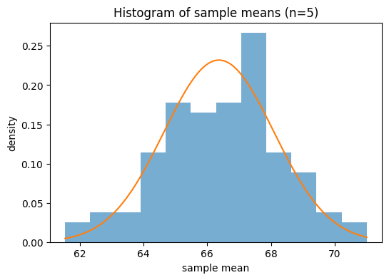
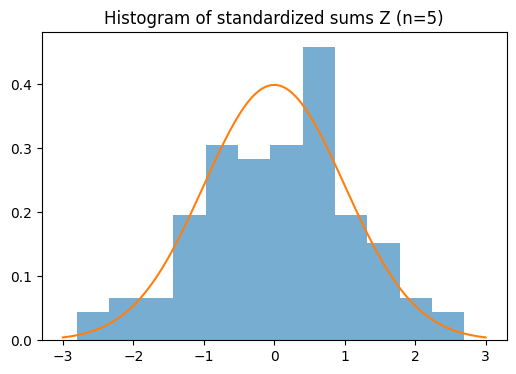
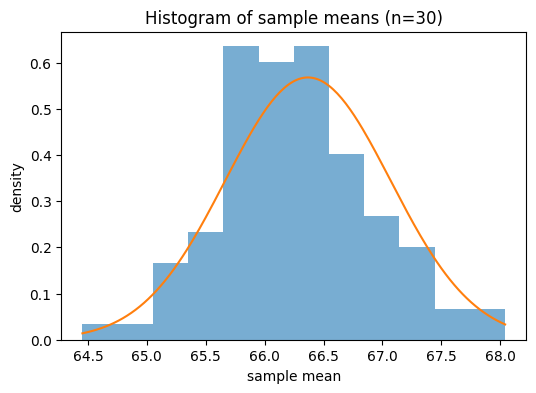
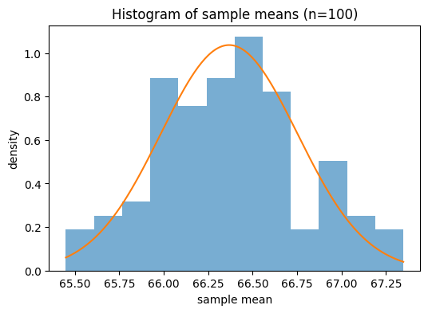
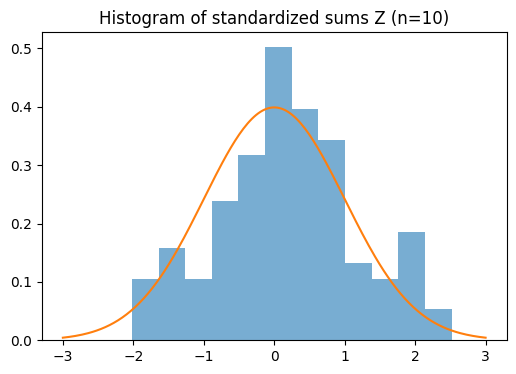
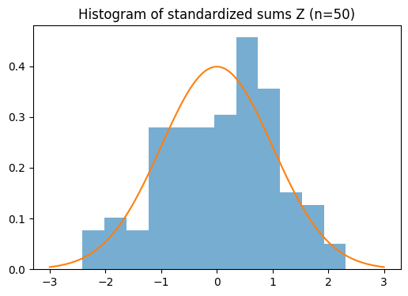
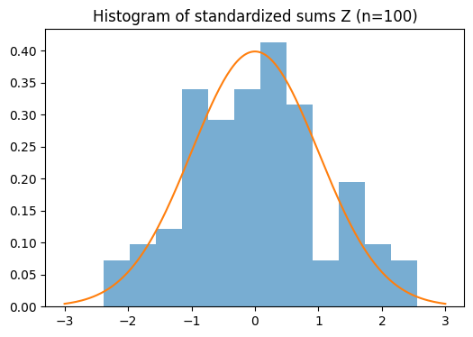

# STATISTICS-2 — Extra Activity 5 (Central Limit Theorem)

## Activity title
**ACTIVITY-5: Demonstration of the Central Limit Theorem (CLT)** using the *Height* data from the **Weight–Height** dataset.

---

## Overview / Objective
Is activity ka objective **Central Limit Theorem (CLT)** ko empirically demonstrate karna hai using **Height** data.

We consider two cases:

### Case I — Sampling distribution of the sample mean
For sample sizes:
\[
n \in \{5, 10, 30, 50, 100\}
\]
we repeatedly draw **100 samples** (with replacement), compute their **sample means**, and compare the empirical distribution to:
\[
\bar{X} \approx N\left(\mu,\frac{\sigma^2}{n}\right)
\]
Key idea: As \(n\) increases, the distribution of \(\bar{X}\) becomes more normal and its spread shrinks roughly like \(\sigma/\sqrt{n}\).

### Case II — Sampling distribution of the standardized sum
For the same \(n\), we compute:
\[
Y = \sum_{i=1}^{n} X_i
\]
and standardize:
\[
Z = \frac{Y - n\mu}{\sigma\sqrt{n}}
\]
We compare the empirical distribution of \(Z\) to:
\[
N(0,1)
\]
Key idea: As \(n\) increases, \(Z\) becomes closer to standard normal.

---

## Files in this folder
- `Activity_5_(Colab).ipynb` — main Python/Colab notebook (simulation + plots)
- `ACTIVITY-5(1).xlsx` — Excel dataset (must contain column `Height`)
- `ACTIVITY-5.2.docx` — activity instructions / write-up reference
- `README.md` — documentation + results + plots

---

## Requirements
- Python 3
- numpy
- pandas
- matplotlib
- scipy (`scipy.stats.norm`)
- openpyxl (Excel reading)

Install (local run):
```bash
pip install numpy pandas matplotlib scipy openpyxl
```

---

## How to run (Google Colab recommended)
1. Open `Activity_5_(Colab).ipynb` in Google Colab.
2. Mount drive:
   ```python
   from google.colab import drive
   drive.mount('/content/gdrive')
   ```
3. Set Excel file path:
   ```python
   df = pd.read_excel('/content/gdrive/MyDrive/ACTIVITY-5(1).xlsx')
   heights = df['Height'].values
   ```
4. Run all cells to generate tables + histograms.

---

## Notebook summary (Method)
### Population parameters (treat dataset as population)
- \(\mu\) = population mean of heights
- \(\sigma\) = population standard deviation (using `ddof=0`)

### Experiment settings
- `n_list = [5, 10, 30, 50, 100]`
- `R = 100` repeated samples per \(n\)

For each \(n\):
- Sample with replacement \(R\) times
- Save `sample_means` and `sample_sums`
- Compare empirical mean/SD with theoretical values
- Plot histograms with normal overlays (Case I and Case II)

---

## Results

### Population statistics (from notebook output)
- **Population mean (µ)** ≈ **66.36756**
- **Population sigma (σ)** ≈ **3.847336**

---

## Case I — Sampling Distribution of the Sample Mean

Theoretical:
\[
\bar{X} \approx N\left(\mu,\frac{\sigma^2}{n}\right), \quad
SE(\bar{X}) = \frac{\sigma}{\sqrt{n}}
\]

### Summary table
| Sample Size (n) | Mean of Sample Means | SD of Sample Means | Theoretical SE (σ/√n) |
|---:|---:|---:|---:|
| 5   | 66.4491 | 1.840964 | 1.720581 |
| 10  | 66.6048 | 1.210076 | 1.216634 |
| 30  | 66.2649 | 0.654985 | 0.702424 |
| 50  | 66.4026 | 0.563667 | 0.544095 |
| 100 | 66.3805 | 0.403552 | 0.384734 |

### Interpretation (concise)
- **Center:** Mean of sample means stays close to \(\mu\) (≈ 66.36756).
- **Spread:** SD of sample means decreases as \(n\) increases and is close to \(σ/\sqrt{n}\).
- **Shape:** Histograms become more bell-shaped and narrower for larger \(n\).

---

## Case II — Standardized Sums (Z)

Theoretical:
\[
Z = \frac{Y - n\mu}{\sigma\sqrt{n}} \approx N(0,1)
\]

### Summary table
| n | Mean(Z) | SD(Z) |
|---:|---:|---:|
| 5   | 0.0474  | 1.0700 |
| 10  | 0.1950  | 0.9946 |
| 30  | -0.1462 | 0.9325 |
| 50  | 0.0644  | 1.0360 |
| 100 | 0.0336  | 1.0489 |

### Interpretation (concise)
- **Center:** Mean(Z) is near 0.
- **Spread:** SD(Z) is near 1.
- **Shape:** As \(n\) increases (especially \(n \ge 30\)), distribution aligns more closely with standard normal.

---

## Plots

> Note: Right now, the images are stored with these filenames in this folder (no `plots/` subfolder).
> If you later move them into `plots/`, just update the paths below.

### Case I — Sample Means
**n = 5**  


**n = 10**  


**n = 30**  


**n = 50**  


**n = 100**  


### Case II — Standardized Sums (Z)
**n = 5**  


**n = 10**  


**n = 30**  


**n = 50**  


**n = 100**  


---

## Conclusion
Across both cases, results validate the CLT:
- \(\bar{X}\) approaches \(N(\mu,\sigma^2/n)\),
- and \(Z\) approaches \(N(0,1)\) as \(n\) increases.

As \(n\) increases, the match improves in:
- **Center** (closer to theoretical mean),
- **Spread** (closer to \(σ/\sqrt{n}\) or 1),
- **Shape** (more bell-shaped histograms).

---

